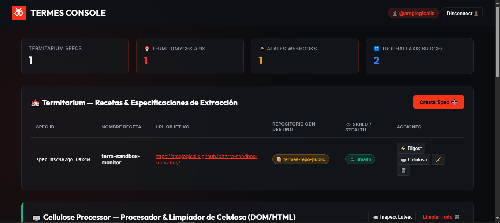

<p align="center">
  
</p>

<h1 align="center">🕷️ TERMES — Public Inverted APIs & Web Digesting Engine</h1>

<p align="center">
  <b>Terra Ecosystem • Autonomous Web Digesting, Headless Automation & Inverted APIs Engine at $0 Cost</b>
</p>

<p align="center">
  <a href="https://www.npmjs.com/package/terra-termes"></a>
  <a href="https://amglogicalis.github.io/termes-repo-public/"></a>
  <a href="https://github.com/amglogicalis/termes-repo-public"></a>
  <a href="https://opensource.org/licenses/MIT"></a>
</p>

---

<p align="center">
  
</p>

---

## 💡 What is TERMES?

**TERMES** is the autonomous web digesting, headless automation, and synthetic API engine of the **Terra Ecosystem** (inspired by termite mound biology and symbiotic digestion).

It allows developers to turn **ANY website without an API**, e-commerce store, legacy portal, SPA, or document into a live **Inverted API** and **Site-to-Webhook** event trigger with **100% Privacy & Security** and **$0 Monthly Server Overhead**.

> [!IMPORTANT]
> **No Git Cloning Needed!**
> The core Terra monorepo is private. TERMES is distributed globally over the internet as an open-access NPM package (**`terra-termes`**) and live Web Console. You do **NOT** need to clone any repository to use TERMES in your terminal or applications.

---

## ⚡ How TERMES Works (The Inverted API Concept)

In traditional web development, APIs are published and controlled by target service providers (who often paywall or restrict them).

**TERMES Inverted APIs** invert this relationship:

```
                            🏰 TERMES CONSOLE / TERMITARIUM
                                   (Control Plane)
                                          │
                ┌─────────────────────────┼─────────────────────────┐
                ▼                         ▼                         ▼
        👃 NASUTE WORKERS        🕳️ MUD TUNNEL PROXY        🪵 CELLULOSE PROCESSOR
      (Headless Execution)      (Stealth & Anti-Bot)          (HTML/DOM Cleaning)
                │                         │                         │
                └─────────────────────────┼─────────────────────────┘
                                          ▼
                               🦠 PROTOZOA ENGINE
                      (Parser CSS/XPath & Schema Builder)
                                          │
                ┌─────────────────────────┴─────────────────────────┐
                ▼                                                   ▼
       🌐 SYNTHETIC REST API                                 🦟 ALATES SWARM
     (Termitomyces - 0ms CDN)                             (Inverted Webhooks Engine)
                │                                                   │
                └─────────────────────────┬─────────────────────────┘
                                          ▼
                                 🔄 TROPHALLAXIS
          (Feeds to Combase/Rolla & AWS/Azure/GCP Multi-Cloud Bridges)
```

1. **Declare Spec (Termitarium 🏰)**: Define CSS selectors, XPath rules, or regex patterns for the target data you want to extract from any website in the world.
2. **Stealth Navigation (Mud Tunnel 🕳️ & Nasute Workers 👃)**: TERMES navigates target sites using headless runners with anti-bot bypass, stealth headers, and proxy rotation.
3. **Digest Raw Content (Cellulose Processor 🪵 & Protozoa Engine 🦠)**: Cleans raw HTML/DOM trees and digests unstructured cellulose into clean JSON schemas.
4. **Publish Synthetic REST API (Termitomyces 🍄)**: Cultivates and publishes live **Synthetic REST APIs** on global CDN (GitHub Pages / Raw CDN) with **0ms server delay** and **$0 cost**.
5. **Site-to-Webhook (Alates Swarm 🦟)**: Converts passive websites into active **Inverted Webhooks**. TERMES monitors DOM content changes and dispatches instant `POST` alerts to your app, Discord, or Slack.
6. **Multi-Cloud Data Feeds (Trophallaxis 🔄)**: Streams digested data directly to Terra Titans (**Combase**, **Rolla**, **Lumina**) and Cloud Providers (**AWS S3**, **Azure Blob**, **GCP Storage**).

---

## 🏛️ Ecosystem Core Concepts & Terminology

| Biological Metaphor | Module Name | Technical Function |
| :--- | :--- | :--- |
| 🏰 **Termitarium** | **Extraction Spec Engine** | Control panel & recipe manager storing target URLs and CSS selectors. |
| 👃 **Nasute Workers** | **Headless Execution** | Autonomous web runners executing extraction tasks. |
| 🕳️ **Mud Tunnel** | **Stealth Layer** | User-Agent rotation, stealth proxying, and Anti-Bot bypass. |
| 🪵 **Cellulose** | **DOM Content** | Unstructured raw HTML, JavaScript DOM trees, or document tables. |
| 🦠 **Protozoa** | **Symbiotic Parser** | Schema builder converting raw DOM nodes into structured JSON objects. |
| 🍄 **Termitomyces** | **Synthetic APIs** | Live public or private REST endpoints served from global CDNs at 0ms. |
| 🦟 **Alates Swarm** | **Inverted Webhooks** | Site-to-Webhook engine firing HTTP alerts when target DOM varies. |
| 🔄 **Trophallaxis** | **Multi-Cloud Bridges** | Data exchange pipelines feeding Combase, Rolla, AWS, Azure, and GCP. |

---

## 📦 Global Installation & Quick Start

Installing TERMES requires only **Node.js 18+** installed on your machine.

### Option 1: Global CLI Installation (Recommended)

Install `terra-termes` globally via NPM:

```bash
# Install globally from NPM
npm install -g terra-termes

# Verify installation
termes --version
```

### Option 2: Instant NPX Execution (No Setup)

Run TERMES CLI directly without permanent installation:

```bash
# Launch live web console directly
npx terra-termes console

# Create an extraction spec
npx terra-termes spec list
```

---

## 🔑 Authentication Setup

TERMES uses a GitHub Personal Access Token (PAT) with `repo` permissions to publish 0ms Synthetic APIs and maintain state at $0 cost.

Set your token as an environment variable in your terminal:

```bash
# On Linux / macOS
export GITHUB_TOKEN="ghp_your_github_personal_access_token"

# On Windows PowerShell
$env:GITHUB_TOKEN="ghp_your_github_personal_access_token"
```

---

## 💻 CLI Commands Reference

### 🌐 Launch Termes Console
```bash
termes console
```
*Opens the official live TERMES Console in your default web browser.*

---

### 🏰 Termitarium Extraction Specs & Inverted APIs

```bash
# 1. Create a new Inverted API Spec
termes spec create --name "tracker-precios" --url "https://tienda.com/producto" --selectors '{"precio":".price-tag","titulo":"h1"}'

# 2. List all active extraction specs
termes spec list

# 3. Digest a spec and publish live Synthetic API
termes spec digest --id spec_xyz123

# 4. Delete a spec
termes spec delete --id spec_xyz123
```

---

### 🦟 Alates Swarm — Inverted Webhooks (Site-to-Webhook)

```bash
# 1. Create an Inverted Webhook trigger
termes webhook create --name "Alerta Cambio Precio" --url "https://mi-app.com/webhook" --condition on_change

# 2. List active webhooks
termes webhook list

# 3. Delete a webhook
termes webhook delete --id wh_xyz123
```

---

### 🔄 Trophallaxis — Multi-Cloud Bridges

```bash
# 1. Create a multi-cloud bridge for AWS S3
termes bridge create --name "Sync S3 Bucket" --type aws_s3 --endpoint "https://aws-bridge.com/events"

# 2. List active bridges
termes bridge list
```

---

## 🛠️ Node.js & TypeScript SDK Usage

You can import `terra-termes` directly into any Node.js, Next.js, Express, or TypeScript project:

```typescript
import { Termes } from 'terra-termes';

// Initialize TERMES SDK
const termes = new Termes({
  githubToken: process.env.GITHUB_TOKEN!
});

// Load state from Vault
await termes.init();

// 1. Create an Inverted API Spec
const spec = await termes.createSpec(
  'laptop-price-tracker',
  'https://store.com/laptops',
  {
    title: 'h1.product-title',
    price: '.product-price'
  },
  {
    description: 'E-commerce price tracker',
    cdnRepo: 'termes-repo-public',
    apiIsPrivate: false
  }
);

// 2. Digest target URL and publish Synthetic API to CDN
const { result, cdnUrl } = await termes.digestSpec(spec.specId);

console.log('✔ Digested in:', result.durationMs, 'ms');
console.log('🌐 Live Inverted Synthetic API URL (0ms CDN):', cdnUrl);
console.log('📦 Extracted Data:', result.data);

// 3. Create an Inverted Webhook (Site-to-Webhook)
const webhook = await termes.createInvertedWebhook(
  'Price Change Trigger',
  'https://myapp.com/api/webhooks',
  'on_change'
);
```

---

## 🌐 Live Online Console

Access the official TERMES Web Console hosted on GitHub Pages:
👉 **[https://amglogicalis.github.io/termes-repo-public/](https://amglogicalis.github.io/termes-repo-public/)**

---

<p align="center">
  <b>Powered by Terra Ecosystem • $0 Monthly Server Cost • MIT License</b>
</p>
